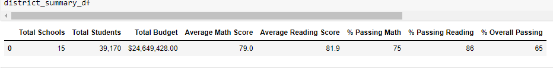
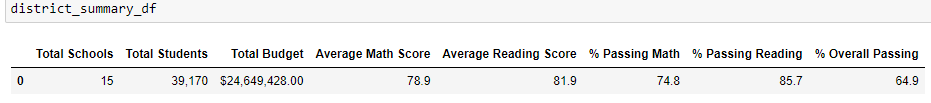
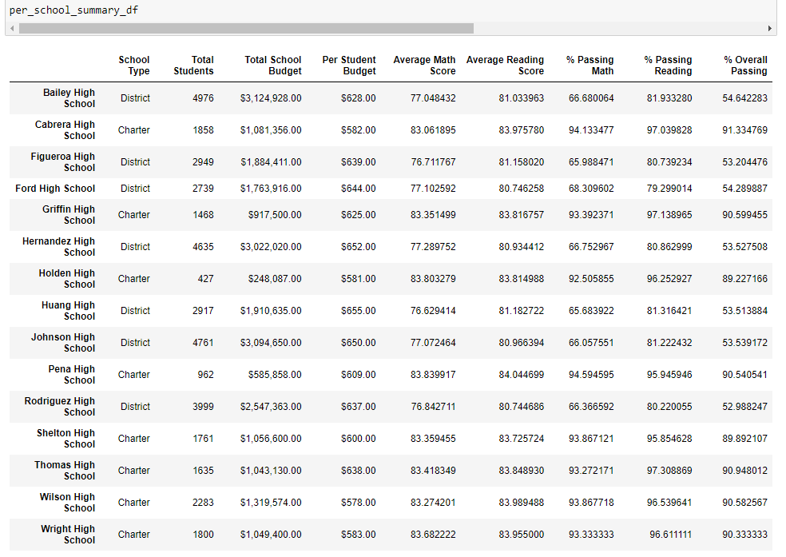
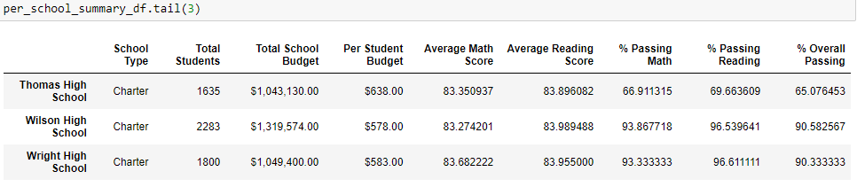

# School District Analysis Challenge

## Overview of the Project:

### Project Background:
The purpose of this analysis is to help Maria, a chief data scientist for a school district, with creating all standardized test data for analysis, reporting and presentation which will provide insight about performance trends and patterns. These insights are used to inform and make strategic decisions at school and district level. 

Task is to aggregate the data and showcase trends in school performance which will help the school board and superintendent in making the decision regarding school the budget and priorities.  

- A highlevel snapshot of the district's key metrics, presented in a table format
- An overview of the key metrics for each school, presented in a table format
- Tables presenting each of the following metrics:
- Top 5 and bottom 5 performing schools, based on the overall passing rate
- The average math score received by students in each grade level at each school
- The average reading score received by students in each grade level at each school
- School performance based on the budget per student
- School performance based on the school size 
- School performance based on the type of school
 
### Purpose:

The school board has notified Maria and her supervisor that the students_complete.csv file shows evidence of academic dishonesty; specifically, reading and math grades for Thomas High School ninth graders appear to have been altered. The following needs to be performed:

- Replace the math and reading scores for Thomas High School with "NaN" while keeping the rest of the data intact. 
- After replacing the math and reading scores with "NaN", school district analysis needs to be repeated.

## Resources:

Data Source: 

School data - [schools_complete.csv](Resources/schools_complete.csv)
Students data - [students_complete.csv](Resources/students_complete.csv)
Software: Python 3.6.1, Pandas library, Jupyter Notebook

## School District Analysis and Results

For this school district analysis ([PyCitySchools_Chalenge.ipynb](PyCitySchools_Chalenge.ipynb)),Python Pandas library and Python NumPy module were used, along with Jupyter Notebook.  A development environment called PythonData was created which uses Python version 3.6.

In this analysis, using Pandas loc method with conditional statements, comparison and logical operators was used to select 9th grade reading and math scores for Thomas High School.  Pandas NumPy module was used to change math and reading grades to NaN. For school performance based on budget and School Size bins were used.

## Results: 

Below describes how the key analysis points were affected by updating the Thomas High school 9th grade math and reading scores, the average math score went down, average reading score remained the same, % passing math went down, % passing reading went down, overall passing percentage went down. 

School District:

School District original analysis:

School District analysis after updating scores:

The analysis showed the following:

- Average Math Score wnet down from 79.0 to 78.9
- Average reading score went down from 81.9 to 81.9
- % Passing Math wnet down from 75% to 74.8%
- % Passing Reading went down from 86% to 85.7%
- % Overall Passing went down from 65% to 64.9%

School Summary:

School Summary original analysis:

School Summary analysis after replacing math and reading scores:

The analysis showed the fllowing:	
- Average Math Score wnet down from 83.42 to 83.35
- Average Reading Score went down from 83.85 to 83.9
- % Passing Math went down from 93.27% to 66.91%
- % Passing Reading went down from 97.3% to 69.66%
- % Overall Passing went down from 90.95% to 65.08%

	
Thomas High School’s performance relative to the other schools :

The original analysis showed that Thomas High School was number 2 in top schools based on %Overall Passing at 90.94.  After replacing the ninth graders’ math and reading scores, its position dropped to number 8.

Math and reading scores by grade:  

After replacing the ninth grade math and reading scores,  the data shows “nan” in the 9th grade column for math and reading for Thomas High School.

Scores by school spending:

For the “Spending ranges for $630-644” category,  
- % Passing Math went down from 73% to 67%
- % Passing Reading went down from 84% to 77% 
- % Overall passing went down from 63% to 54%

Scores by school size:

In the Medium (1000-2000) school size category, 
- % Passing Math went down from 94% to 88 
- % Passing Reading went down from 97% to 91%
- % Overall Passing went down from 91% to 85%.

Scores by school type:

For “Charter” school type 
- % Passing Math category went down from 94% to 90% , 
- % Passing Reading category went down from 97% to 93%, 
- % Overall Passing category went down from 90% to 87%.

## Summary 

There were four changes in the updated school district analysis after reading and math scores for the ninth grade at Thomas High School have been replaced with NaNs.

- Total Student Count for Thomas High School only included 10th graders, 11th graders and 12th graders.
- Passing Math Percentage was calculated using the new total student count 
- Passing Reading Percentage was calculated using the new total student count 
- Overall Passing Percentage (which included students who passed math and reading both) was calculated using the new total student count 

After the above calculations were updated, subequent calculations that used this data was also affected by it. Overall, it was clear that there was an impact on the results after removing the 9th grade math and reading scores for Thomas High School. 

